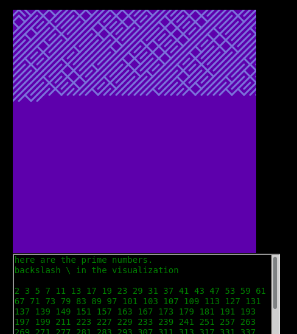
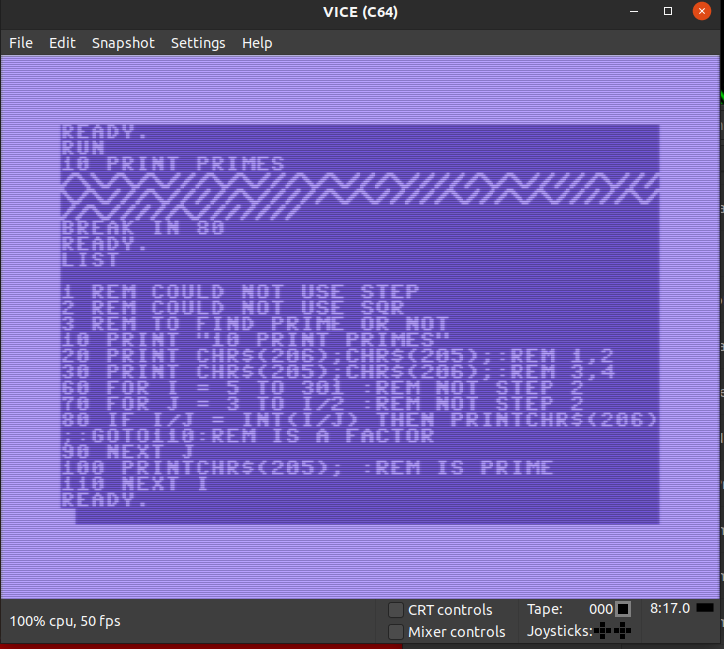

# 10print-prime
10 PRINT with prime numbers

[see it live here p5 editor](https://editor.p5js.org/greggelong/present/rI2_FI6UY)
[see it live gitHub](https://greggelong.github.io/10print-prime/10printPrimeDom/)

A little fun with #10print, here visualizing prime numbers with "\\", composite numbers with "/". Using #P5js. Using HTML textArea like a retro terminal. The script uses frameCount to iterate over the natural numbers (positive integers starting with one). then tests with a textbook prime checking function which returns true or false.

The prime checking function is not practical but I am amazed at how fast the browser is at checking even 4 digit numbers. I am not even using the most basic optimization for finding primes.  I am just checking to the number not to the square root of the number!!!! The idea came out of preparing some basic coding algorithms for middle school kids and The Coding Train's great [10 Print coding challenge](https://thecodingtrain.com/CodingChallenges/076-10print.html). I think it's a fun way to approach the prime number algorithm in a novel way. 

[A discussion of why you can optimize to squre root](https://stackoverflow.com/questions/5811151/why-do-we-check-up-to-the-square-root-of-a-prime-number-to-determine-if-it-is-pr)

[An even more impractical algorithm for finding primes in Python](https://github.com/greggelong/factors) throwing all factors of a number into an array. Checking the array length. If len(array) is 2 it's prime!!

----------

I have also added to the this repository a version done in Commodore 64 basic.  
There is a human readable text file of the BASIC code and a .d64 disk you can load with vice.
just look at the code from the link at the top of the page!

[Greg's Website](https://greggelong.github.io/)
